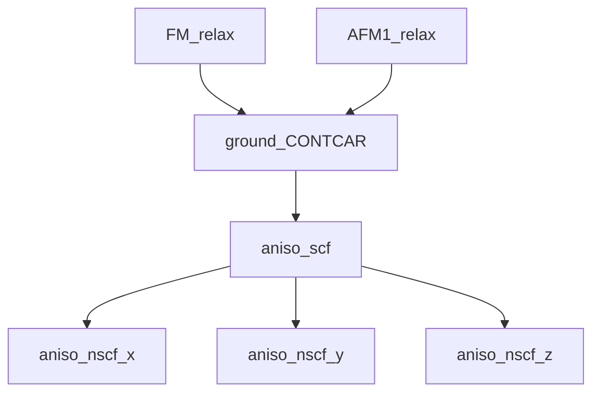

# Balsam codes for running anisotropy workflow

This is an extension of the magnetic moment workflow. In summary, it will take the relaxed CONTCAR and magnetic configuration from the lowest energy calculation among its parents and will run a VASP scf job with spins-orbit coupling off. Then VASP nscf calculations with SO will run based on the scf CHGCAR  with the spins polarized along the x, y, and z axes.

## Preliminaries

To make the workflow able to run, you need to have set up a balsam site + workflow with the VASP workflow. To set this up see the README file in the head folder.

Now, in `vasp_apps.py` replace `VASP_BIN_NCL` and `VASP_BIN_STD` with the path to your executables for vasp and replace `janus_db` in the balsam site name with the name of your balsam site.

## Using the workflow

To load the app, run `python vasp_apps.py`. This will define the app `ElectronicRelaxVasp` in the balsam environment. 

> Once these are loaded, you will not need to run this again in the balsam site unless you delete the **apps** with `balsam app rm`. As a note, deleting jobs does not delete the apps.

Once the apps are defined, you can now add jobs using add_aniso_calcs.py. To add new jobs, run:

```
add_aniso_calcs.py -s <site_name> --system System1 System2 ... --parents FM_relax AFM1_relax --kpoints <KPOINTS file> 
```

 - Replace <site_name> with the name of your balsam site
 - Replace the list System1, etc. with the list of systems you want to add jobs for
 - If you have more than one AFM configuration in the collinear calculations, you can add their names after --parents to add it to the list of configurations that the job considers for picking the ground state. 
 - if you want to just use the same kpoints as the parent, replace the --kpoints flag with --keep_parent_kpoints. Otherwise balsam will use the kpoints from the KPOINTS file passed to the kpoints argument

To modify the VASP running parameters, you can set these in add_aniso_calcs.py. Just change the arguments set in `SCF_incar_overwrite` and `NSCF_incar_overwrite`.

## Workflow Diagram

